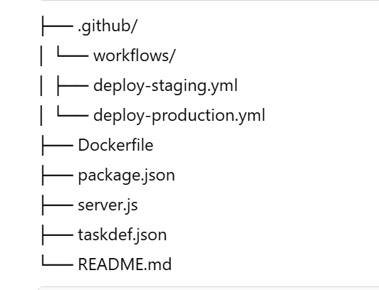

# 🚀 Node.js CI/CD with GitHub Actions & AWS ECS (Fargate)

This project demonstrates how to set up a **CI/CD pipeline** using **GitHub Actions** to automatically deploy a **Node.js** application to **AWS ECS (Fargate)** when a new release tag is pushed.

---

## ✅ Features

- 🐳 Build & push Docker images to **Amazon ECR**
- 🚀 Deploy to **staging** and **production** ECS Services
- 🔐 Manage secrets securely with **AWS Secrets Manager**
- 🔄 Automatically update ECS Task Definitions and services
- 🔧 Trigger deployments with Git tags (e.g., `staging-*`, `prod-*`)

---

## 🗂 Project Structure




---

## ⚙️ Prerequisites

### ☁️ AWS Setup

- ✅ ECS Cluster: `nodejs-cluster` in `us-east-1`
- ✅ ECR Repository: `simple-app`
- ✅ Application Load Balancers (ALBs) for staging & production
- ✅ IAM User: `github-actions` with:
    - `AmazonECS_FullAccess`
    - `AmazonEC2ContainerRegistryFullAccess`
    - `SecretsManagerReadWrite`
- ✅ IAM Role: `ecsTaskExecutionRole` with:
    - ECS execution permissions
    - Secrets Manager access
- ✅ MongoDB Atlas or similar with URIs for staging and production

### 🐙 GitHub Repository

Includes:
- Node.js source code (`server.js`, `package.json`)
- `Dockerfile`
- `taskdef.json` for ECS task definition
- GitHub Actions workflows in `.github/workflows/`

---

## 🔐 GitHub Secrets

Add these in **GitHub → Settings → Secrets → Actions**:

| Name                    | Description                            |
|-------------------------|----------------------------------------|
| `AWS_ACCESS_KEY_ID`     | IAM user's access key                  |
| `AWS_SECRET_ACCESS_KEY` | IAM user's secret access key           |
| `AWS_REGION`            | AWS region (e.g. `us-east-1`)          |
| `ECR_REPOSITORY`        | Name of ECR repo (`simple-app`)        |
| `ECS_CLUSTER_NAME`      | Name of ECS cluster (`nodejs-cluster`) |
| `ECS_SERVICE_NAME`      | ECS service name per environment       |
| `ECS_TASK_DEFINITION`   | Task family name (e.g. `simple-app`)   |
| `MONGO_URI_STAGING`     | Staging DB URI                         |
| `MONGO_URI_PRODUCTION`  | Production DB URI                      |

---

## 🐳 Dockerfile

```dockerfile
FROM node:18-alpine

WORKDIR /app

COPY package*.json ./
RUN npm install

COPY . .

EXPOSE 3000

CMD ["node", "server.js"]
```

📄 ECS Task Definition (taskdef.json)
```{
  "family": "simple-app",
  "networkMode": "awsvpc",
  "requiresCompatibilities": ["FARGATE"],
  "cpu": "256",
  "memory": "512",
  "executionRoleArn": "arn:aws:iam::YOUR_ACCOUNT_ID:role/ecsTaskExecutionRole",
  "containerDefinitions": [
    {
      "name": "simple-app",
      "image": "<IMAGE_URI>",
      "portMappings": [
        {
          "containerPort": 3000,
          "protocol": "tcp"
        }
      ],
      "essential": true,
      "environment": [
        {
          "name": "MONGO_URI",
          "value": "<MONGO_URI>"
        }
      ]
    }
  ]
}```

⚙️ GitHub Actions Workflows
.github/workflows/deploy-staging.yml
name: Deploy to Staging

on:
  push:
    tags:
      - 'staging-*'

jobs:
  deploy:
    runs-on: ubuntu-latest

    steps:
      - name: Checkout code
        uses: actions/checkout@v3

      - name: Configure AWS credentials
        uses: aws-actions/configure-aws-credentials@v2
        with:
          aws-access-key-id: ${{ secrets.AWS_ACCESS_KEY_ID }}
          aws-secret-access-key: ${{ secrets.AWS_SECRET_ACCESS_KEY }}
          aws-region: ${{ secrets.AWS_REGION }}

      - name: Login to Amazon ECR
        id: login-ecr
        uses: aws-actions/amazon-ecr-login@v2

      - name: Build and Push Docker Image
        run: |
          IMAGE_URI="${{ steps.login-ecr.outputs.registry }}/${{ secrets.ECR_REPOSITORY }}:staging-${GITHUB_SHA}"
          docker build -t $IMAGE_URI .
          docker push $IMAGE_URI
          echo "IMAGE_URI=$IMAGE_URI" >> $GITHUB_ENV

      - name: Prepare Task Definition
        run: |
          sed -e "s|<IMAGE_URI>|${IMAGE_URI}|g" \
              -e "s|<MONGO_URI>|${{ secrets.MONGO_URI_STAGING }}|g" \
              taskdef.json > taskdef-staging.json

      - name: Register Task Definition
        id: register-task
        run: |
          TASK_DEF_ARN=$(aws ecs register-task-definition \
            --cli-input-json file://taskdef-staging.json \
            --query 'taskDefinition.taskDefinitionArn' \
            --output text)
          echo "TASK_DEF_ARN=$TASK_DEF_ARN" >> $GITHUB_ENV

      - name: Update ECS Service
        run: |
          aws ecs update-service \
            --cluster ${{ secrets.ECS_CLUSTER_NAME }} \
            --service simple-app-staging \
            --task-definition $TASK_DEF_ARN
.github/workflows/deploy-production.yml
Same as staging, but with:

Tag: 'prod-*'

Secrets: MONGO_URI_PRODUCTION

Service name: simple-app-production

🚀 Trigger Deployments via Git Tags

To deploy to staging:

git tag staging-1.0.0
git push origin staging-1.0.0
To deploy to production:

git tag prod-1.0.0
git push origin prod-1.0.0

🧪 Local Testing
Build and run the Docker image locally:

docker build -t simple-app .
docker run -p 3000:3000 simple-app

📝 Notes
Cloud logs available via Amazon CloudWatch

ECS Fargate automatically pulls new image versions

Rollback by re-tagging previous version

ECS autoscaling recommended for high availability
📚 Resources
Amazon ECS Docs
https://docs.aws.amazon.com/AmazonECS/latest/developerguide/Welcome.html
GitHub Actions for AWS
https://github.com/aws-actions
